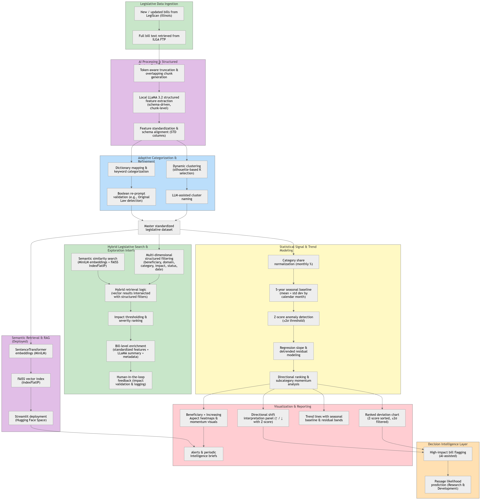

# UIUC Legislative Intelligence Platform

## AI-Powered Legislative Intelligence for Strategic University Decision Support

The Legislative Intelligence Platform converts unstructured legislative text into standardized intelligence signals, hybrid semantic retrieval systems, and statistically modeled trend insights for institutional decision-making. By combining large language models, adaptive feature standardization, hybrid semantic search, and seasonal anomaly detection, the platform enables the University of Illinois to understand policy direction, detect emerging signals, and assess institutional impact with analytical rigor.

The platform enables leadership to move from reactive policy monitoring to proactive institutional strategy.

This site serves as the central gateway to the platform’s tools, interactive intelligence interfaces, and ongoing research and development initiatives.

---

## Platform Access

### Search and Filter Interface

Explore legislation using a hybrid intelligence interface that combines multi-dimensional structured filtering (policy domain, beneficiaries, impact severity, status, date, category) with semantic similarity search powered by vector embeddings. Results are ranked, enriched with standardized AI-extracted features, and support human-in-the-loop validation.

[Launch Search Interface](https://huggingface.co/spaces/tajoshi2/RAG_Pipeline)

---

### Trends and Visualization Dashboard

Analyze seasonally adjusted legislative activity using 5-year monthly baselines, Z-score anomaly detection, regression-based trend modeling, and directional momentum analysis. The system identifies statistically significant deviations, accelerating categories, and emerging policy shifts. All anomaly detection is derived from historical seasonal baselines and regression-adjusted residual modeling to ensure analytical rigor.

[Launch Visualization Dashboard](https://huggingface.co/spaces/ralate2/Legsislation_Data_2019_2026)

---

### Legislative Assistant (Conversational AI Interface)

The Legislative Assistant delivers structured, citation-backed analysis of Illinois legislative activity in response to natural language questions. Built within the Microsoft Copilot AI Agent framework using GPT-4.1, it operates in a controlled, session-based environment designed for contextual reasoning and rapid legislative interpretation.

This assistant complements the platform’s deployed semantic retrieval system (MiniLM + FAISS). While the retrieval system supports structured filtering and vector-based similarity search, the Legislative Assistant focuses on synthesis, explanation, and executive-ready insight.

Responses are structured to include:

- **Short answer** (1–3 sentences)  
- **What the bill does**  
- **Where it applies / who it affects**  
- **Key dates & status**  
- **Potential UI impacts** (clearly marked as interpretation)  
- **Citations / bill references**

[Launch Legislative Assistant](https://copilotstudio.microsoft.com/environments/Default-44467e6f-462c-4ea2-823f-7800de5434e3/bots/copilots_header_bee2b/webchat?__version__=2)

---

### Network and Influence Graphs (Legacy Prototype – October 2025)

This feature was originally developed in October 2025 as an early-stage prototype. It demonstrates how LLaMA-extracted features can be used to map relationships across legislative goals, beneficiaries, policy domains, and institutional impact patterns.

We plan to further develop this capability to advance relational intelligence modeling and support deeper cross-domain trend analysis.

[View Interactive Legislative Network Graphs →](https://tayler-erbe.github.io/Legislative-Network-Graphs/)

*Status: Under active development*

---

## How the Platform Works

### End-to-End System Workflow

Below is the complete architectural workflow of the Legislative Intelligence Platform.

  

---

The system follows an end-to-end analytical pipeline:

### 1. Data Ingestion

Legislative data is sourced directly from **LegiScan** and the **Illinois General Assembly (ILGA) FTP site**, ensuring access to official bill text, status updates, and metadata across sessions.

Data is refreshed on a recurring weekly ingestion schedule to reflect newly introduced and updated legislation.

Raw legislative files are standardized into structured, queryable formats for downstream analytics.

Current scope: Illinois legislative data (expandable architecture).

---

### 2. Document Chunking

Bills are truncated to safe processing limits and segmented into structured text units to enable scalable large-language-model analysis and retrieval workflows.  
Chunking ensures long legislative documents can be analyzed efficiently while preserving contextual continuity.

---

### 3. AI-Based Feature Extraction

Large language models extract structured legislative intelligence from each bill, including:

- **Llama Summary** – Plain-language overview of the bill’s purpose and actions.  
- **Legislative Goal** – The primary intended policy outcome.  
- **Policy Domain** – High-level policy categories or issue areas.  
- **Key Provisions** – Core legal changes introduced.  
- **Intended Beneficiaries** – Stakeholders directly affected.  
- **Legislative Strategy** – Procedural or political design embedded in the bill.  
- **Increasing Aspects** – What the bill expands, funds, authorizes, or strengthens.  
- **Decreasing Aspects** – What the bill reduces, restricts, repeals, or eliminates.  
- **Category & Subcategory** – Assigned political or institutional classification labels.  
- **Ideological Alignment** – Inferred ideological framing when identifiable.  
- **Potential Impact** – Concise assessment of possible implications for UIUC.  
- **Impact Rating** – Structured impact level (Very Impactful, Moderately Impactful, Slightly Impactful, Not Impactful).  
- **Intent** – One-sentence articulation of legislative purpose.  
- **Motivation** – One-sentence explanation of the underlying driver or context.  
- **Original Law** – Referenced statutes or legal frameworks being amended or cited.

These features convert unstructured legislative language into structured intelligence signals.

All AI-generated outputs are structured, standardized, and designed for human review within institutional governance processes.
---

### 4. Scoring, Standardization, and Analytical Enrichment

Extracted features are normalized through multiple independent analytical methods, including:

- Adaptive clustering with silhouette-based K selection
- LLM-assisted cluster naming
- Dictionary-based mapping for stable features
- Boolean re-prompt validation for structured signals (e.g., Original Law)
- Feature normalization & schema alignment (STD columns)
- Residual modeling for long-term trend adjustment

Entities (actors, institutions, policy objects) and actions (mandates, appropriations, restrictions) are extracted to construct relationship networks that map how legislative goals connect across domains, enabling advanced network graph analysis and influence modeling.

---

### 5. Interactive Exploration

Users access search tools, dashboards, visualization components, and conversational AI tools to explore legislative intelligence at scale.

The platform enables filtering by policy domain, impact rating, beneficiaries, ideological patterns, institutional relevance, and temporal activity.

---

## Platform Vision

The Legislative Intelligence Platform is designed to evolve into a comprehensive institutional intelligence system that supports both active analytical capabilities and ongoing research initiatives.

### Active Capabilities

- Early signal detection  
- Statistical anomaly modeling with seasonal baselines  
- Hybrid semantic + structured legislative retrieval  
- AI-assisted executive reporting  
- Institutional impact monitoring  

### Research & Development Initiatives

- Probability-of-passage modeling  
- Cross-policy and cross-state influence modeling  
- Advanced legislative relationship graph analytics  

## Contributors

**Platform Architect & Technical Lead**  
Tayler Erbe, Data Scientist  

**AI Solutions Team Lead & AI Chatbot Lead**  
Pramod Joshi, AI Coordinator  

**Data Engineering & Pipeline Architecture Lead**  
Tejasri Joshi, Data Science Analyst  

**AI Engineer, Retrieval-Augmented Search Systems**  
Tanvi Lakhani, Data Science Analyst  

**Predictive Modeling & Policy Analytics Analyst**  
Ruchita Alate, Data Science Analyst 

---

## Contact

For collaboration, research partnerships, or technical inquiries, please contact the project team.
